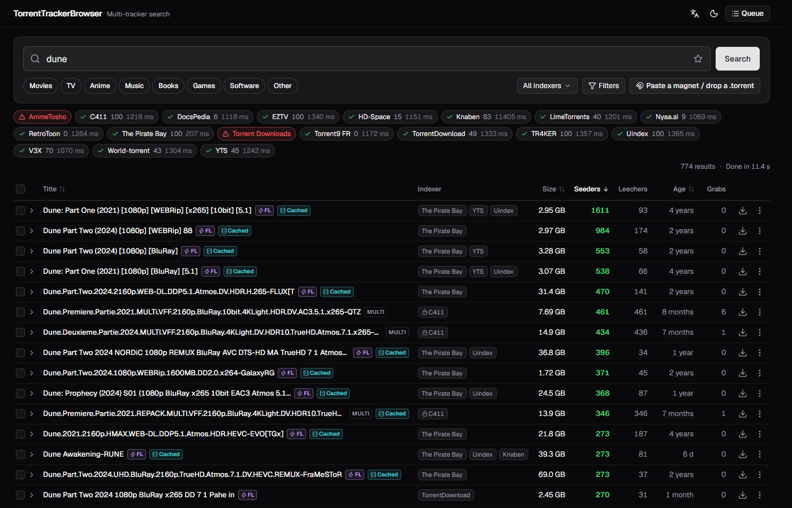
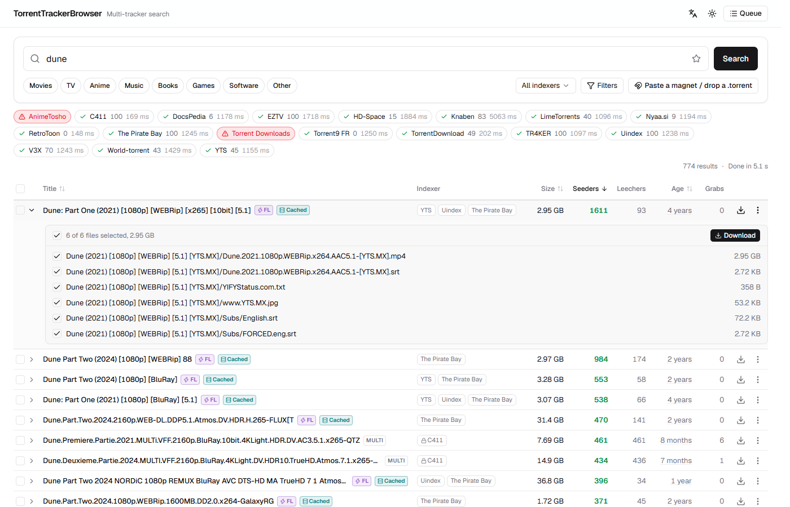
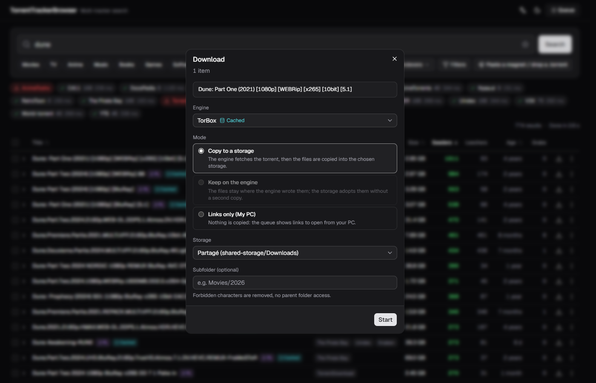
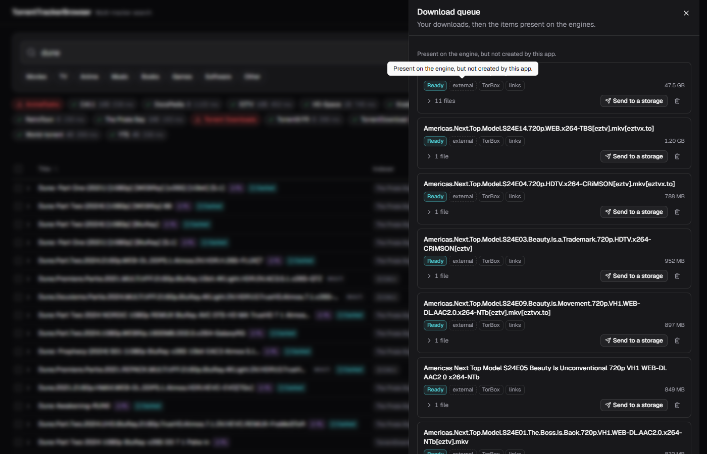
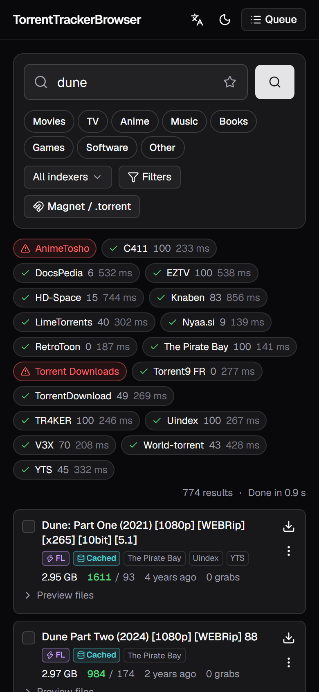

# TorrentTrackerBrowser

Self-hosted web app to search torrents across many sources, pick a result (or paste a magnet /
drop a `.torrent`), and have it fetched to a storage of your choice. Sources (indexer
aggregators), engines (debrid services, torrent clients) and storages (mounted folders) are
pluggable adapters declared in a YAML config; the UI renders whatever the backend reports.

- Backend: Go, single static binary, embeds the frontend, no database.
- Frontend: SvelteKit (static), Svelte 5, Tailwind v4, shadcn-svelte.
- First adapters: Prowlarr (source), TorBox and qBittorrent (engines), local path (storage).

See [PLAN.md](PLAN.md) for the design and [API.md](API.md) for the HTTP contract.

## Screenshots

Results stream in per indexer; the strip at the top shows each indexer's state and latency.



A row expands to the torrent's file list, with per-file selection.



The download dialog picks the engine (with the cached state), the delivery mode and the storage.



The queue lists the app's jobs plus the items already on the engines, with send-to-storage.






## Run in production (Docker)

```bash
cd deploy
cp ../.env.example .env            # secrets
cp config.example.yaml config.yaml # adapters, storages, limits
docker compose up -d --build
```

The container listens on `:8080`; put your reverse proxy in front (see `deploy/caddy.snippet`).
It runs as `PUID:PGID` from `.env`, which must be allowed to write the storage mounts.

## Develop (Docker)

```bash
cp .env.example .env
cp server/config.example.yaml server/config.dev.yaml   # point storages at /storage
docker compose up
```

UI on <http://localhost:5173> with HMR; the API on `:8080` reloads on save. `web/README.md`
documents the frontend-only mock mode (`npm run dev:mock`) for UI work without any backend.

## Layout

```
web/       SvelteKit app
server/    Go module (core, adapters, api, ui embed)
deploy/    production compose, config example, proxy snippet
```
